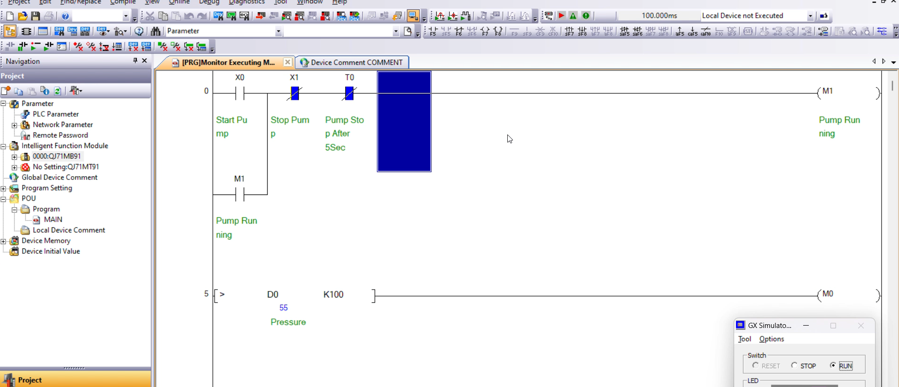
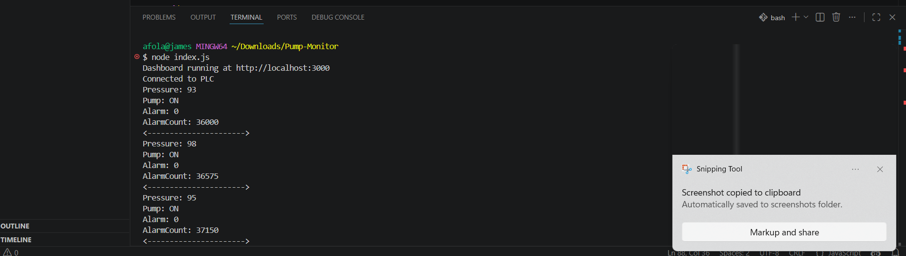
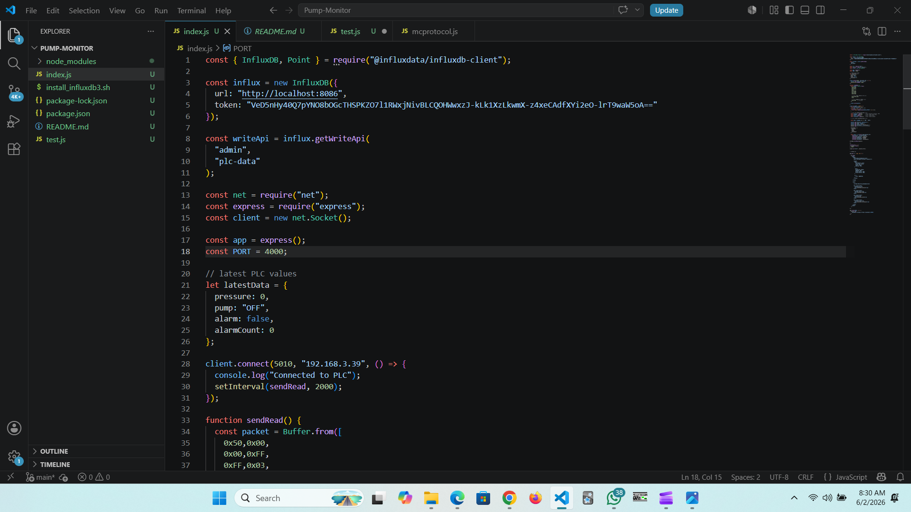
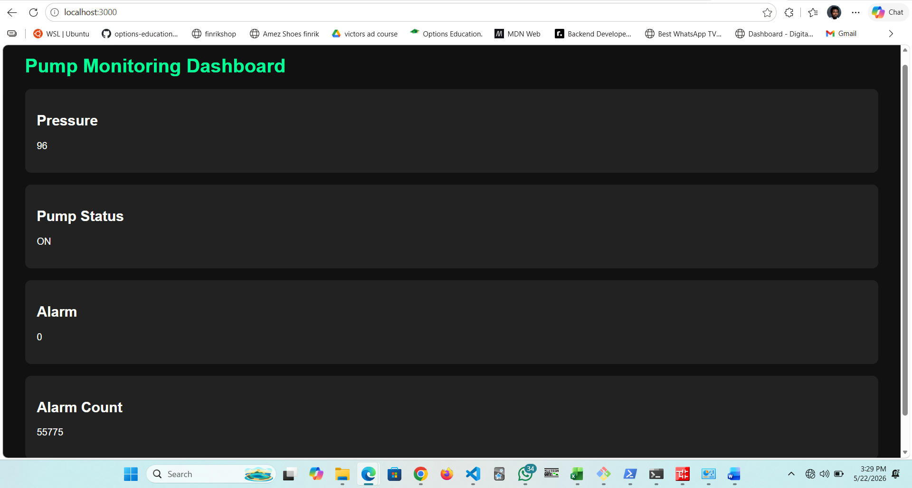
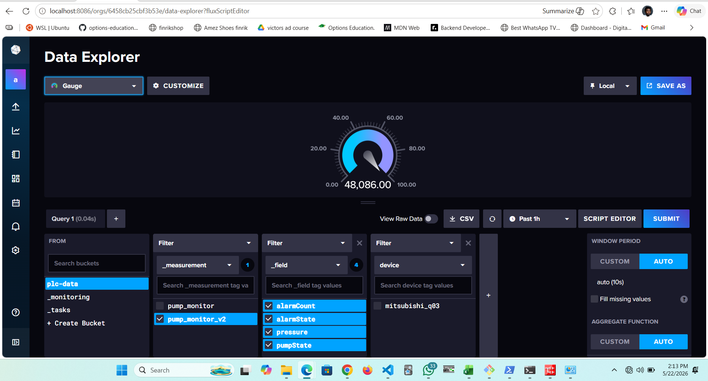
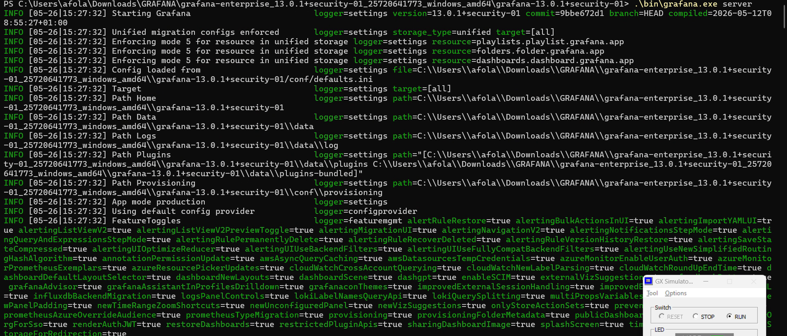

# Industrial PLC Monitoring System

## Overview

This project demonstrates a complete Industrial IoT monitoring solution using a Mitsubishi PLC, Node.js, InfluxDB, and Grafana.

The system reads live process data from a Mitsubishi PLC over Ethernet using the Protocol, stores the data in InfluxDB as a time series database, visualizes live process values through a custom Express web dashboard and provides advanced monitoring and analytics through Grafana dashboards.

The project simulates a pump monitoring system with real time process variables including:

* Pressure
* Pump Status
* Alarm Status
* Alarm Count

---

## System Architecture

```text
Mitsubishi PLC
      │
      ▼
Node.js Data Collector
      │
      ▼
InfluxDB Time Series Database
      │
      ├────────► Local Express Dashboard
      │
      ▼
Grafana Dashboard
```

---

## Technologies Used

### Industrial Automation

* Mitsubishi PLC
* Ladder Logic
* MC Protocol Ethernet Communication

### Backend

* Node.js
* Express.js

### Data Storage

* InfluxDB

### Visualization

* Grafana

### Development Tools

* Visual Studio Code
* Git
* GitHub

---

## Features

### PLC Communication

* Reads live PLC register values
* Ethernet based communication
* Continuous polling of process data

### Data Processing

* Parses PLC memory registers
* Converts raw values into process variables
* Updates dashboard in real time

### Time Series Storage

* Stores process values in InfluxDB
* Maintains historical records
* Supports trend analysis

### Web Dashboard

* Built with Express.js
* Auto refresh every 3 seconds
* Displays current process values

### Grafana Dashboard

* Real time pressure trend
* Pump status monitoring
* Alarm monitoring
* Historical analytics

---

## PLC Register Mapping

| PLC Register | Description |
| ------------ | ----------- |
| D0           | Pressure    |
| D10          | Pump State  |
| D11          | Alarm State |
| D12          | Alarm Count |

---

## Example Data Flow

```text
PLC Register Values

D0  = 90
D10 = 1
D11 = 0
D12 = 5

↓

Node.js Processing

Pressure   = 90
Pump State = ON
Alarm      = OFF
AlarmCount = 5

↓

InfluxDB Storage

pressure = 90
pumpState = 1
alarmState = 0
alarmCount = 5

↓

Grafana Dashboard
```


## Screenshots

### PLC Ladder Logic



### Node.js Terminal Output




### Express Dashboard



### InfluxDB Data Explorer




### Grafana Dashboard




---

## Sample Node.js PLC Data Processing

```javascript
const pressure = getD(0);
const pumpReg = getD(10);
const alarm = getD(11);
const alarmCount = getD(12);

const point = new Point("pump_monitor_v2")
  .tag("device", "mitsubishi_q03")
  .floatField("pressure", pressure)
  .intField("pumpState", pumpReg)
  .intField("alarmState", alarm)
  .intField("alarmCount", alarmCount);

writeApi.writePoint(point);
```

---

## Grafana Dashboard Panels

The Grafana dashboard contains:

1. Pressure Trend
2. Pump State
3. Alarm State
4. Alarm Count

These panels provide both real time monitoring and historical process analysis.

---

## Future Improvements

* AWS Cloud Deployment for remote access
* Email Alerting and SMS Notification
* Mobile Dashboard Access
* Multiple PLC Support

---

## Learning Outcomes

This project demonstrates practical experience with:

* Industrial Automation
* PLC Communications
* Time Series Databases
* Real Time Monitoring Systems
* Industrial Data Visualization
* Industrial IoT Architecture
* Node.js Backend Development

---

## Author

James Afolabi

Industrial Automation | PLC Programming | Industrial IoT | Cloud & Monitoring Systems
